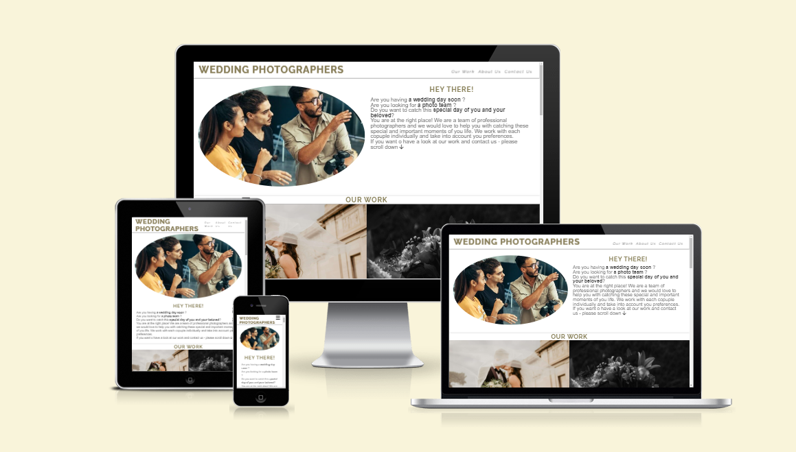

# [WEDDING PHOTOGRAPHER](https://dfedyachkina.github.io/wedding-photographer)

Wedding Photographer is a platform designed to help people find the perfect photographers and videographers for their wedding day. They can explore the team's portfolio, learn more about their experience and style and easily get in touch with them to discuss their specific needs. This site ensures that people find professionals who can beautifully capture the memories of their special day.

source: [amiresponsive](https://ui.dev/amiresponsive?url=https://dfedyachkina.github.io/wedding-photographer)

## UX

For this site, extensive research was conducted on existing wedding photography websites to understand their design and usability. The goal is to provide a user-friendly interface that is not only easy to navigate but also immerses visitors in the wedding atmosphere. The chosen design evokes positive associations with the wedding day, enhancing the overall user experience.

### Colour Scheme

The colors have been chosen based on popular wedding themes and hues that contrast well with each other, ensuring a user-friendly interface that is easy to read.

- `#3a3a3a` used for primary text.
- `#877f57` used for primary highlights.
- `#fafafa` and `#ececece5` used for secondary text.
- `#a39a6b` and `#532c00` used for secondary highlights.

I used [coolors.co](https://coolors.co/e84610-009fe3-4a4a4f-445261-d63649-e6ecf0-000000) to generate my colour palette.

### Typography

- [Raleway](https://fonts.google.com/specimen/Raleway) was used for the primary headers and titles.

- [Montserrat](https://fonts.google.com/specimen/Montserrat) was used for all other secondary text.

- [Font Awesome](https://fontawesome.com) icons were used throughout the site, such as the social media icons in the footer.

## Features

### Existing Features

- **Navigation**

    - Featured at the top of the page, the navigation shows the name of the company in the left corner: WEDDING PHOTOGRAPHER that links to the top of the page.
    - The other navigation links are to the right: Our Work, About Us and Contact Us which link to different sections of the page.
    - The navigation is in a wedding style font, and colors that contrasts background.
    - The navigation clearly tells the user the name of the company and website and makes the different sections of information easy to find.

- **The Header**

    - The header contains the greetings, using the colour of dark beige.
    - The header contains a little introduction of the company, using the color of dark grey.
    - The section provides the user with clear information what the company is and what they are doing. 

- **The Our Work Section**

    - The Our Work section gives an opportunity to the user to have a look at the pictures and videos which have been made by the company.

- **The About Us Section**

    - The About Us section contains the information about company and staff of the company which would help the user to get know more the company.

- **The Contact Us Section**

    - The Contact Us section has a form to collect a details of the potential client for contacting him.
    - The form collects First Name, Last Name, Email Address, Phone number and preferences how user want to be contacted.

- **Footer**

    - The Footer contains icons with the links of the social media, which gives ability to the user find us on other social platforms.

### Future Features

- Database
    - All user's details send to the Client Database, where would be all potential clients/clients. 
- Availabality calendar
    - The calendar which provides availabalities of the team and user can pick up the day and book it.
- Review and rating form
    - The form which allow to the user provides a feedback of his experience with the company. It would help the company will grow and see expectations of the clients.

## Tools & Technologies Used

-  used for version control. (`git add`, `git commit`, `git push`)

-  used as a cloud-based IDE for development.

-  used for the main site content.
-  used for the main site design and layout.

-  used for hosting the deployed front-end site.

-  used for the icons.
-  used to help debug, troubleshoot, and explain things.

- [Pixels](https://www.pexels.com/) used to find pictures for photo section.
- [Youtube](https://youtube.com/) used to find a video for video section

## Testing

> [!NOTE]  
> For all testing, please refer to the [TESTING.md](TESTING.md) file.

## Deployment

The site was deployed to GitHub Pages. The steps to deploy are as follows:

- In the [GitHub repository](https://github.com/dfedyachkina/wedding-photographer), navigate to the Settings tab 
- From the source section drop-down menu, select the **Main** Branch, then click "Save".
- The page will be automatically refreshed with a detailed ribbon display to indicate the successful deployment.

The live link can be found [here](https://dfedyachkina.github.io/wedding-photographer)

### Local Deployment

This project can be cloned or forked in order to make a local copy on your own system.

#### Cloning

You can clone the repository by following these steps:

1. Go to the [GitHub repository](https://github.com/dfedyachkina/wedding-photographer) 
2. Locate the Code button above the list of files and click it 
3. Select if you prefer to clone using HTTPS, SSH, or GitHub CLI and click the copy button to copy the URL to your clipboard
4. Open Git Bash or Terminal
5. Change the current working directory to the one where you want the cloned directory
6. In your IDE Terminal, type the following command to clone my repository:
	- `git clone https://github.com/dfedyachkina/wedding-photographer.git`
7. Press Enter to create your local clone.

Alternatively, if using Gitpod, you can click below to create your own workspace using this repository.

Please note that in order to directly open the project in Gitpod, you need to have the browser extension installed.
A tutorial on how to do that can be found [here](https://www.gitpod.io/docs/configure/user-settings/browser-extension).

#### Forking

By forking the GitHub Repository, we make a copy of the original repository on our GitHub account to view and/or make changes without affecting the original owner's repository.
You can fork this repository by using the following steps:

1. Log in to GitHub and locate the [GitHub Repository](https://github.com/dfedyachkina/wedding-photographer)
2. At the top of the Repository (not top of page) just above the "Settings" Button on the menu, locate the "Fork" Button.
3. Once clicked, you should now have a copy of the original repository in your own GitHub account!

### Local VS Deployment

🛑🛑🛑🛑🛑🛑🛑🛑🛑🛑-START OF NOTES (to be deleted)

Use this space to discuss any differences between the local version you've developed, and the live deployment site on GitHub Pages.

🛑🛑🛑🛑🛑🛑🛑🛑🛑🛑-END OF NOTES (to be deleted)

When I deployed the project, I noticed a difference in speed and performance between the local and live deployments.

## Credits

🛑🛑🛑🛑🛑🛑🛑🛑🛑🛑-START OF NOTES (to be deleted)

In this section you need to reference where you got your content, media, and extra help from.
It is common practice to use code from other repositories and tutorials,
however, it is important to be very specific about these sources to avoid plagiarism.

🛑🛑🛑🛑🛑🛑🛑🛑🛑🛑-END OF NOTES (to be deleted)

### Content

| Source | Location | Notes |
| --- | --- | --- |
| [Markdown Builder](https://tim.2bn.dev/markdown-builder) | README and TESTING | tool to help generate the Markdown files |

### Media

| Source | Location | Type | Notes |
| --- | --- | --- | --- |
| [Pexels](https://www.pexels.com) | entire site | image | favicon on all pages |
| [This Person Does Not Exist](https://thispersondoesnotexist.com) | testimonials | image | headshots of fake testimonial images |
| [TinyPNG](https://tinypng.com) | entire site | image | tool for image compression |

### Acknowledgements
- I would like to thank my Code Institute mentor, [Tim Nelson](https://github.com/TravelTimN) for his support throughout the development of this project.
- I would like to thank the [Code Institute Slack community](https://code-institute-room.slack.com) for the moral support; it kept me going during periods of self doubt and imposter syndrome.

