# Testing

> [!NOTE]  
> Return back to the [README.md](README.md) file.

## Code Validation

### HTML

I have used the recommended [HTML W3C Validator](https://validator.w3.org) to validate all of my HTML files.

| Directory | File | Screenshot | Notes |
| --- | --- | --- | --- |
|  | 404.html | 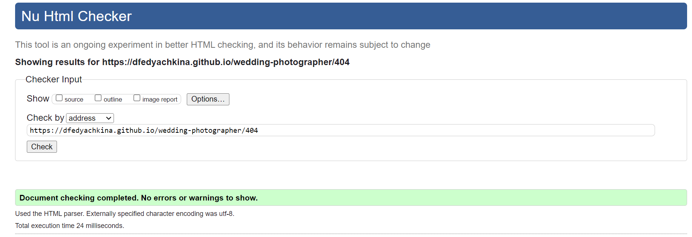 | |
|  | confirmation.html | 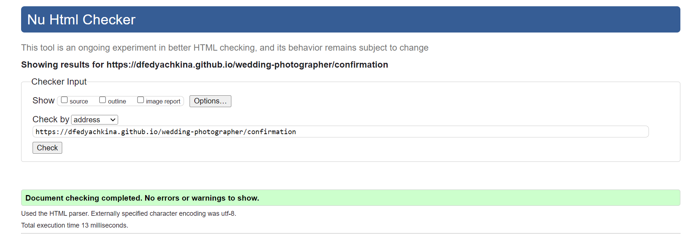 | |
|  | index.html | 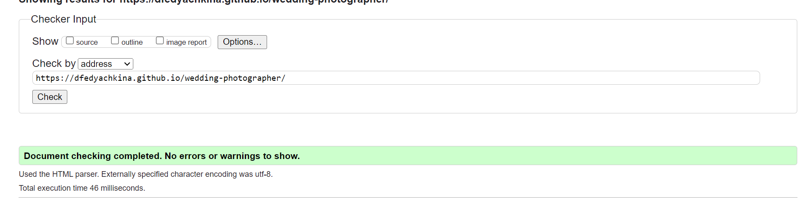 | |

### CSS

I have used the recommended [CSS Jigsaw Validator](https://jigsaw.w3.org/css-validator) to validate all of my CSS files.

| Directory | File | Screenshot | Notes |
| --- | --- | --- | --- |
| assets | style.css | 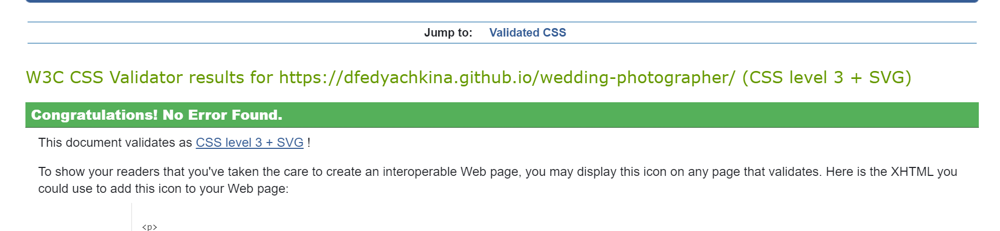 | |

## Browser Compatibility

I've tested my deployed project on multiple browsers to check for compatibility issues.

| Browser | Home | Confirmation | 404 | Notes |
| --- | --- | --- | --- | --- |
| Chrome |  | 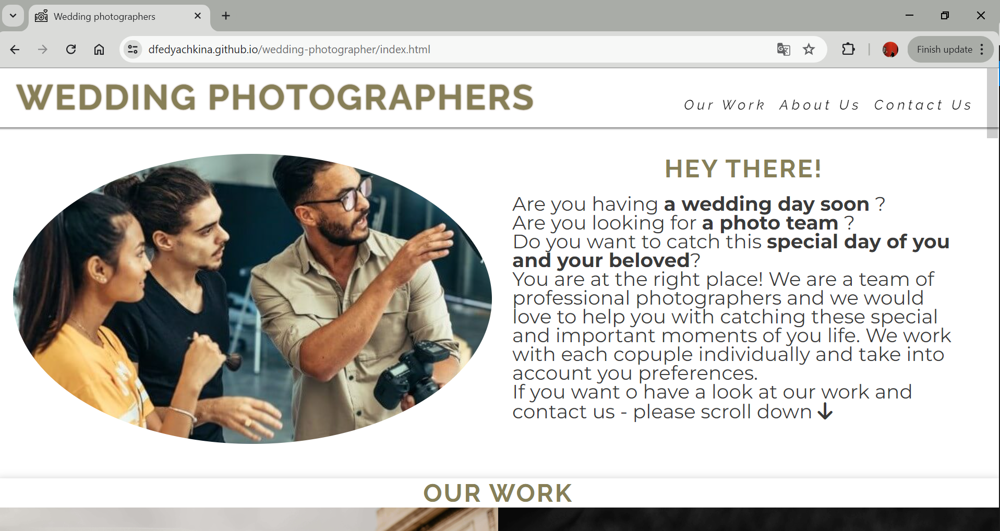 | 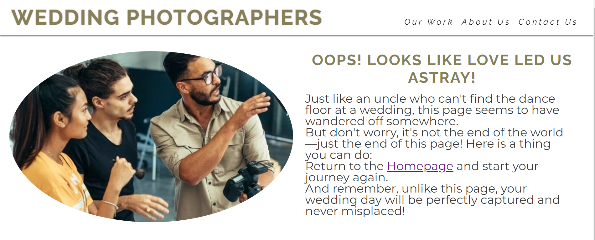 | Works as expected |
| Firefox | 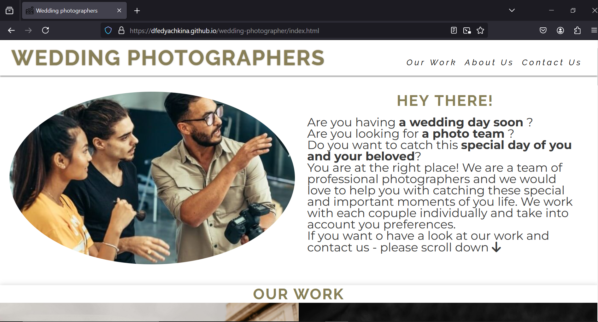 | 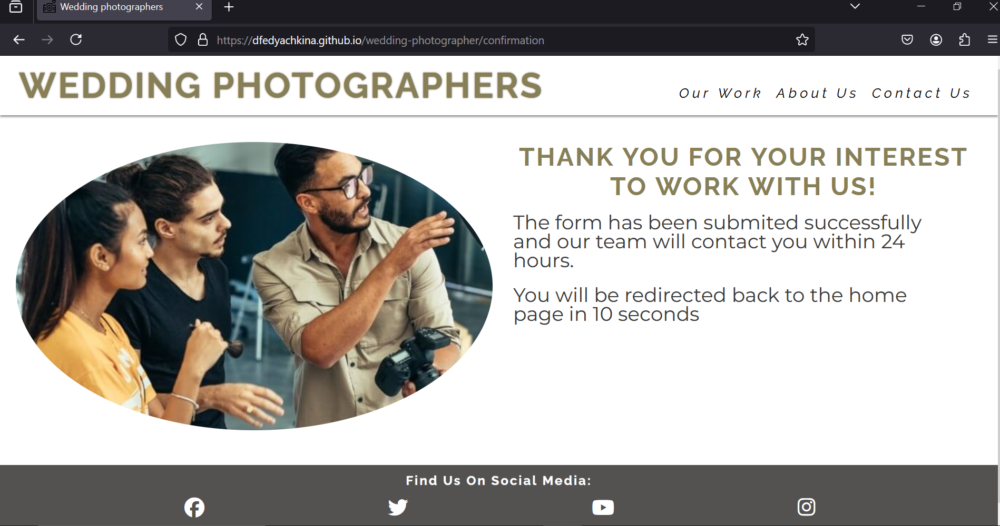 | 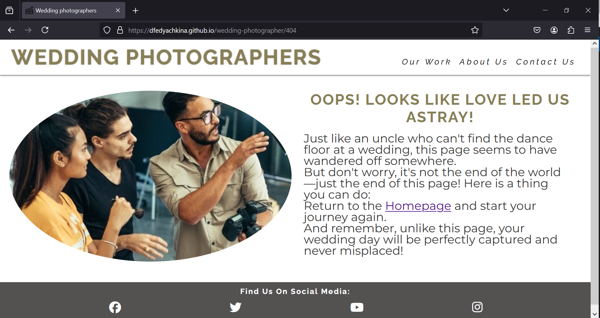 | Works as expected |
| Edge | 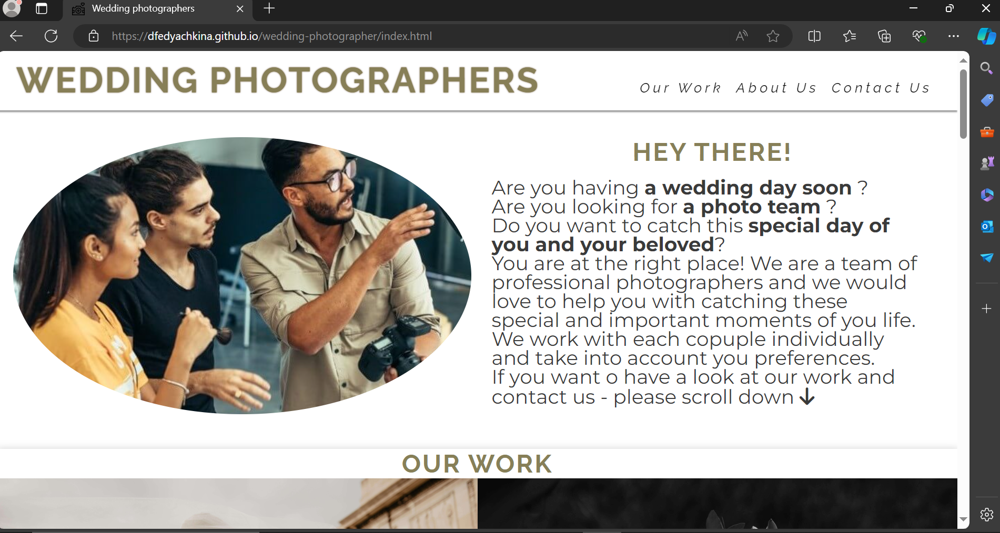 |  | 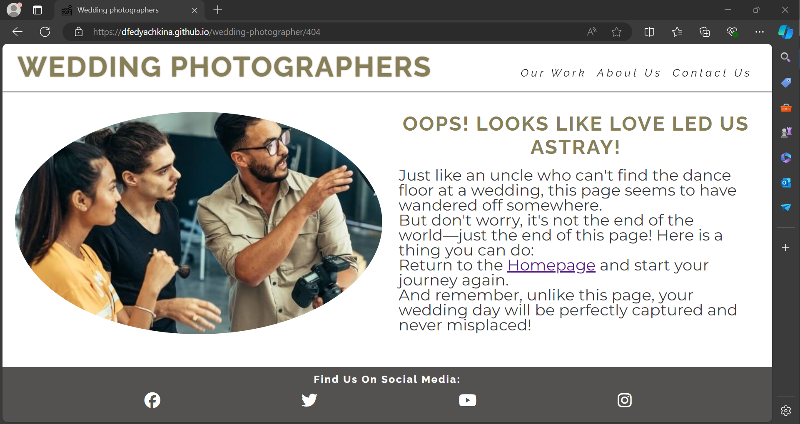 | Works as expected |

## Responsiveness

I've tested my deployed project on multiple devices to check for responsiveness issues.

| Device | Home | Confirmation | 404 | Notes | 
| --- | --- | --- | --- | --- |
| Mobile (DevTools) |  | 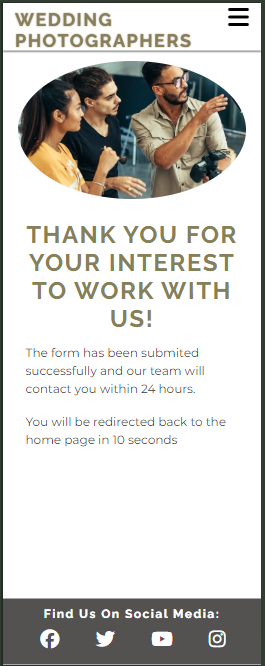 | 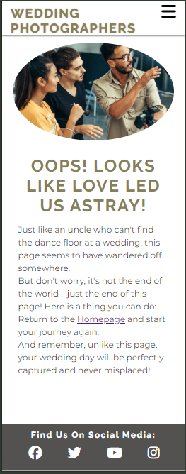 | Works as expected |
| Tablet (DevTools) |  | 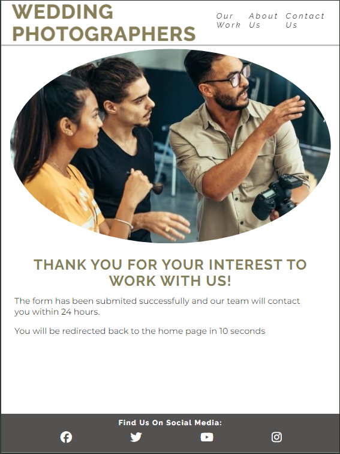 | 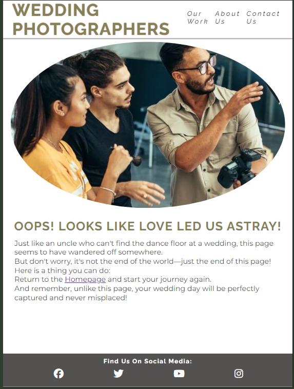 | Works as expected |
| Desktop |  | 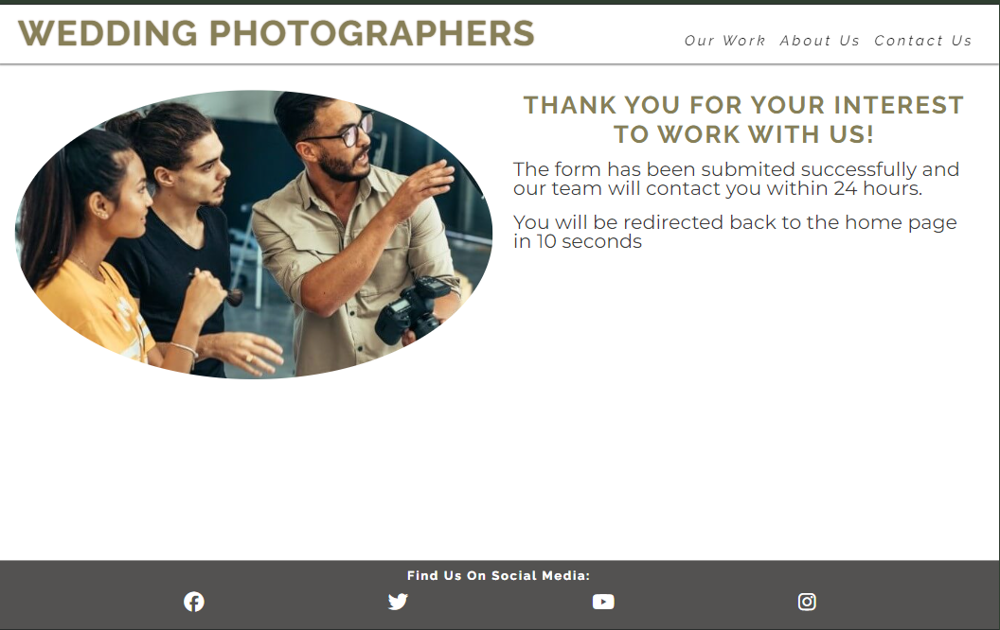 | 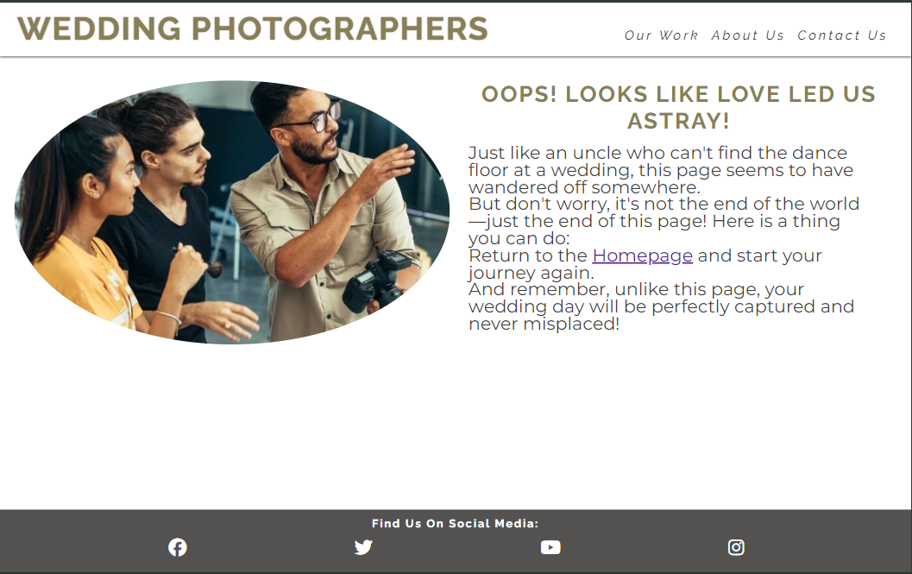 | Works as expected |

## Lighthouse Audit

I've tested my deployed project using the Lighthouse Audit tool to check for any major issues.

| Page | Mobile | Desktop | Notes |
| --- | --- | --- | --- |
| Home | 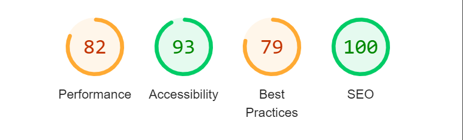 | 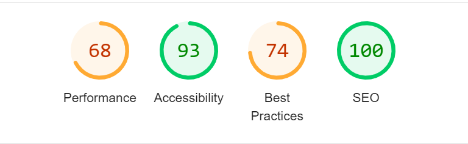 | Some minor warnings |
| Confirmation | 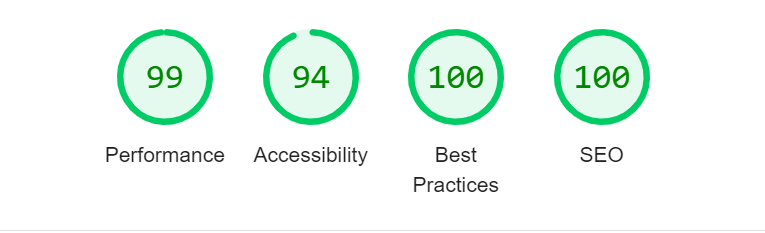 | 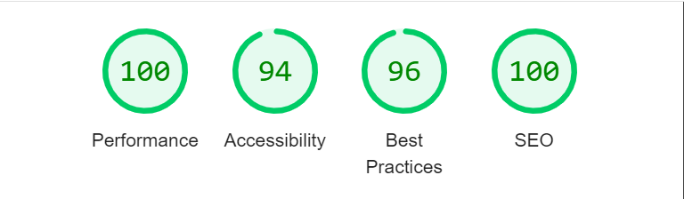 | Some minor warnings |
| 404 | 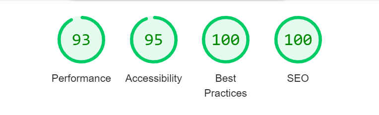 | 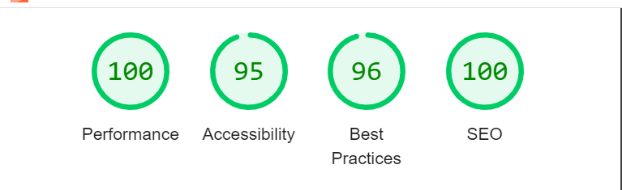 | Some minor warnings |

## Bugs

- The favicon hasn't been load
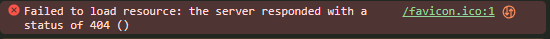

Accidently I added link tags of favicons to the header tag. It has been fixed by moving it to the head tag.

- The navigation bar hides some information in the section when you click to see this section on the navigation bar. 
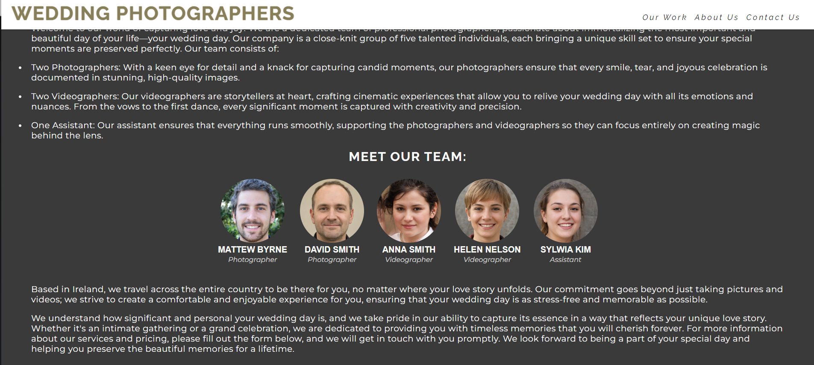

It has been fixed by set up scroll margin top among sections on style.css.

### Unfixed Bugs

> [!NOTE]  
> There are no remaining bugs that I am aware of.
